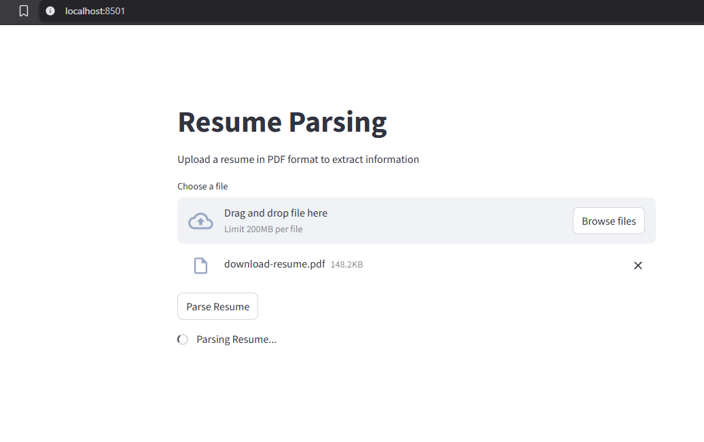
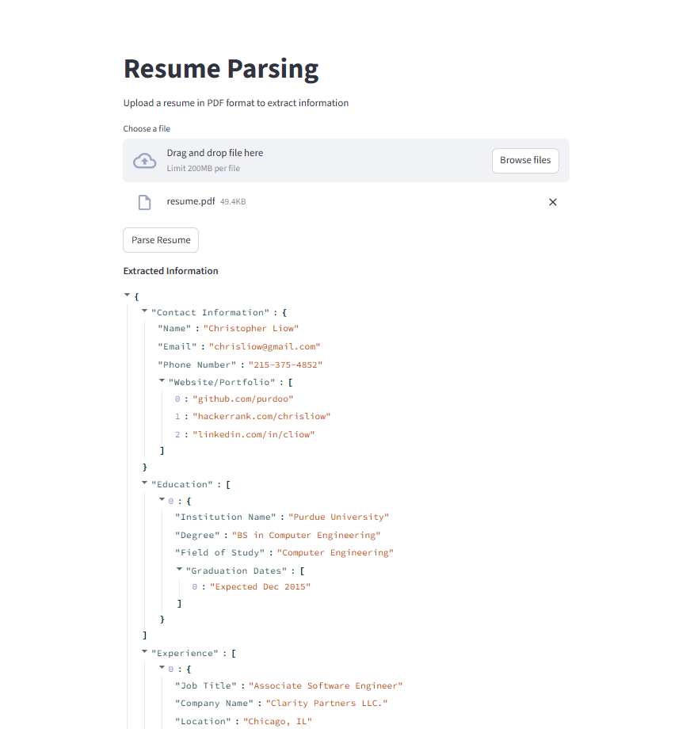

# Resume Parsing with LLM

This is a project I developed to demonstrate resume parsing using Large Language Models (LLMs) and Streamlit for an interactive user interface.

## Features
- Upload resumes in PDF format.
- Extract structured information (e.g., contact details, education, experience) in JSON format.
- Validate and correct JSON output using LLMs.
- Display extracted information in an interactive and user-friendly interface.

## Screenshots

| Upload Resume |   | Extracted Information |
|------------|---|---------------|
|  |   |  |

## Tech Stack
Streamlit • Python • LangChain • PyMuPDF • OpenAI LLMs
